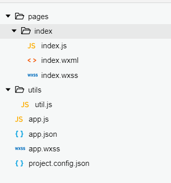
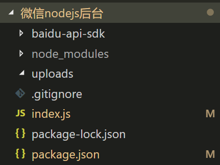
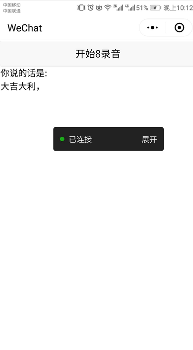
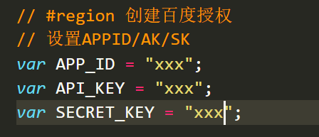

# 介绍

因为项目需要,使用到了微信小程序和百度的语音接口 现在将项目中的一个小模块拿出来单独分享.

# 技术关键字

1. 微信小程序
2. 百度语音接口
3. nodejs,express
4. fluent-ffmegp

# 环境

1. windows 10
2. vs code  1.20.1
3. 微信小程序开发工具 1.02.1802270
4. 花生壳-提供域名和内容穿透-用于方便本地远程调试微信小程序

# 微信小程序

考虑到业务并不复杂,所以就将所有的代码都放在一个页面就可以了(wxml,wxss,js统称为一个页面)

## 文件目录



## 页面


## index.wxml

```html
<button type='default' bindtouchstart='startrecorderHandel' bindtouchend="sendrecorderHandel">开始8录音</button>
<view>
  你说的话是:
  <view>
    {{msg}}
  </view>
</view>
```

## index.js

```javascript
// 录音对象
const recorderManager = wx.getRecorderManager();

function sendRecord(src) {
  var obj = {
    // 已经在花生壳中映射到本地端口-3001 
    url: "http://xxx:34306/post",
    filePath: src,
    name: "fffile",
    header: {
      'Content-Type': 'application/json'
    },
    success: function (result) {
      var data = JSON.parse(result.data);
      // msg 为最终语音识别的字符串
      var msg = data.result;
      // 获取当前页面对象
      var page = getCurrentPages()[0];
      page.setData({ msg: msg });
    },
    fail: function (err) {
      console.log(err);
    }
  };
  wx.uploadFile(obj)
}

// 结束录音的时候触发 
recorderManager.onStop((res) => {
  // 获取文件路径-提交到后台-后台发送到百度
  sendRecord(res.tempFilePath);
})

recorderManager.onError((res) => {
  console.log("error", res);
});

Page({

  /**
   * 页面的初始数据
   */
  data: {
    msg: ""
  },
  // 按下按钮的时候触发
  startrecorderHandel() {
    // 开始录音
    recorderManager.start({
    });
  },
  // 松开按钮的时候触发-发送录音
  sendrecorderHandel() {
    // 结束录音
    recorderManager.stop();
  },

  /**
   * 生命周期函数--监听页面加载
   */
  onLoad: function (options) {
    wx.authorize({
      scope: 'record'
    })
  }
})
```

# 后台nodejs接口

## 文件目录



## index.js

```javascript
var express = require('express');
var app = express();
var fs = require('fs');
var Multiparty = require('multiparty');
// 转码工具
var ffmpeg = require('fluent-ffmpeg');
var AipSpeechClient = require("baidu-aip-sdk").speech;

// #region 创建百度授权 
// 设置APPID/AK/SK
var APP_ID = "xxx";
var API_KEY = "xxx";
var SECRET_KEY = "xxx";

// 百度请求对象
var client = new AipSpeechClient(APP_ID, API_KEY, SECRET_KEY);


// 新建一个对象，建议只保存一个对象调用服务接口
app.post('/post', function (req, res, next) {
  //生成multiparty对象，并配置上传目标路径
  var form = new Multiparty.Form({
    uploadDir: 'uploads/'
  });
  //上传完成后处理
  form.parse(req, function (err, fields, files) {
    var filesTemp = JSON.stringify(files, null, 2);
    var inputFile = files.fffile[0];
    var uploadedPath = inputFile.path;
    var command = ffmpeg();
    command.addInput(uploadedPath)
      // 将1.aac 变为1.wav
      .save(uploadedPath.slice(0, -3) + "wav")
      .on('error', function (err) {
        console.log(err);
      })
      .on('end', function () {
        // 将录音文件转为buffer
        var voice = fs.readFileSync(uploadedPath.slice(0, -3) + "wav");
        var voiceBuffer = new Buffer(voice);

        // 发送buffer到百度接口 返回语音对应的字符串
        client.recognize(voiceBuffer, 'wav', 16000).then(function (result) {
          console.log('<recognize>: ' + JSON.stringify(result));
          res.end(JSON.stringify(result));
        }, function (err) {
          console.log(err);
        });
      });
  });
});
var server = app.listen(3001, function () {
  var host = server.address().address;
  var port = server.address().port;
  console.log('Example app listening at http://%s:%s', host, port);
});
```


# 启动

1. 下载项目

   ```json
   git clone https://github.com/itcastWsy/wx_baidu.git
   ```

2. 使用微信小程序打开 **微信前台** 目录

3. 配置  后台的接口地址

   

4. 打开 **微信nodejs后台** 后台文件夹

5. 输入 `npm i` 安装依赖

6. 输入 命令 启动项目 **npm run start**

   

7. 手机微信扫一扫小程序 - 语音输入 "大吉大利" 



# 注意事项

1. 当使用微信开发工具 发送的语音文件的格式是 **aac**,但是使用手机微信发送的格式是 **m4a**  这里直接处理的是m4a  转码工具是ffmpeg 

2. 关于花生壳,如果不使用也可以,只不过需要自己代码提交到有外网域名的服务器上接口,注意 开发阶段需要打开小程序开发工具内的 **不校验安全域名....**的选项

   

3. 当调用百度接口的时候,需要填写上自己的相关信息



# 联系方式

可以通过邮件联系 yeah126139163@163.com